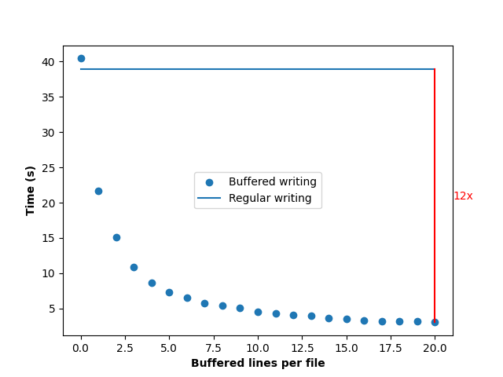

# BufferedWriter

Troubles writing truck loads of data to thousands of different files?

Operating systems pose limits on the number of files that can be accessed simultaneously.
However, opening and closing files for each data element individulally is very slow as the
overhead from the file handling operations accumulates and might even lead to crashes if
files are accessed too frequently.

The BufferedWriter class offers a simple but efficient, approach to solve this problems:
In a dictionary it stores a list of lines for each file. New lines for the files are added
to the respective lists first. Only when the length of a files list exceeds a certain limit
its contents are written to the file collectively.

The BufferedWriter is save to use in combination with multiprocessing.
Conflicts from different BufferedWriters trying to access files simulatanously are rare.
The bufferedWrite will wait for 1/1000 of a second and try again.

## Usage

As context manager:

`
with BufferedWriter(out_dir=out_dir, lines_per_file=i) as writer:

        for line in lines:
            writer.write_line(f"file_{str(line%files_to_write)}", str(line))
`

## Speed test 

I generated a list of 100,000 random integer numbers. Each of these numbers should be
written to one of 1,000 files according to its residual class. Regular writing,
where for each integer number the file is opened and closed, shows to be much slower.

   

